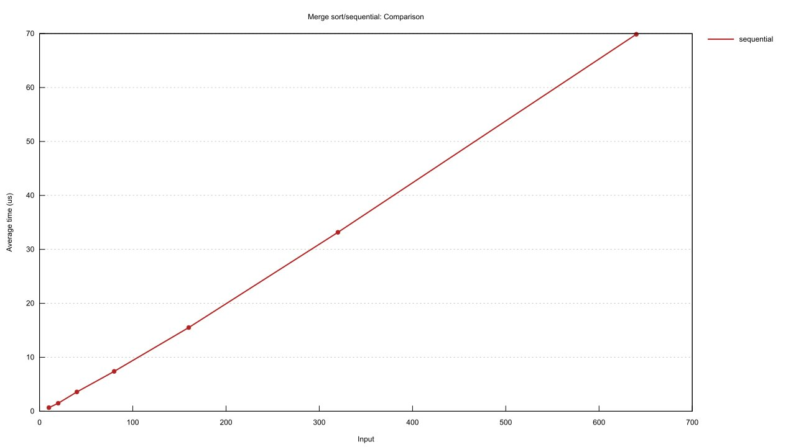
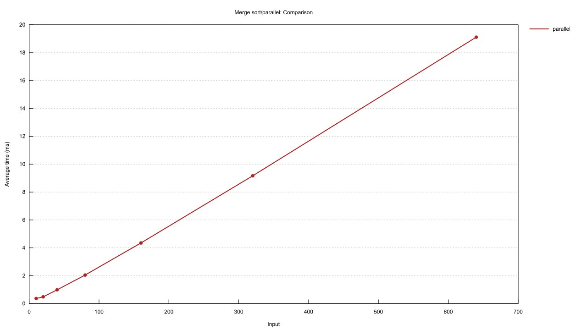
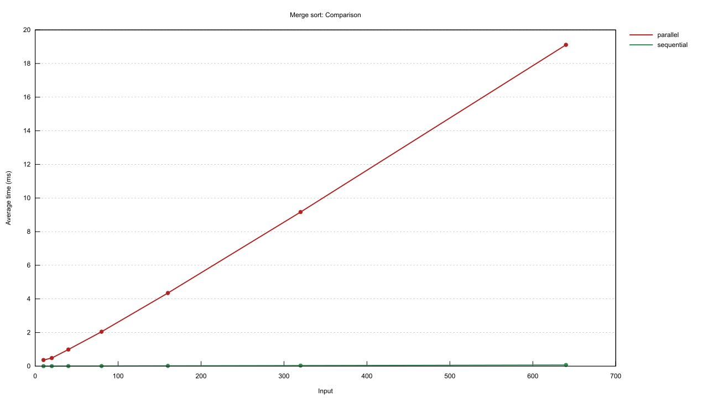

# Learnig rust

[Rust](https://www.rust-lang.org/) is an exciting new language that provides low level control without compromising any high level functionality

## Features
* Statically and strongly typed
* Focused on performance and safety (binaries are almost as fast as C/C++!)
* Memory and thread safety is guaranteed at compile time (no segfaults :partying_face:)

## Modules

### minigrep
A simpe CLI grep clone that searches files for patterns.  
Accepts command line arguements and extra configuration options can be set using environment variables    

Run `minigrep/minigrep` to get more details

```
Usage: minigrep [filename] [query word]  
Environment vars:  
- CASE_INSENSITIVE: performs case insensitive search if set  
- EXACT: Only matches exact queries if set
```


### Mergesort
Implement sequential and parallel merge sort (iterative) implementations

The benchmark is run using [criterion.rs](https://github.com/bheisler/criterion.rs) and uses reverse sorted lists for comparison.
To run it yourself run the `cargo bench` command within the `merge_sort` directory

Comparison plots:   
1. Sequential merge sort  


2. Parallel merge sort  


3. Comparing both  


## Resources
* [ ] [The Rust Programming Language (official book)](https://doc.rust-lang.org/book/)
* [ ] [Programming Rust (O'reilly)](https://www.amazon.in/Programming-Rust-Fast-Systems-Development-ebook/dp/B077NSY211)  
* [ ] [Hands-On Concurrency with Rust](https://www.amazon.in/Hands-Concurrency-Rust-Confidently-memory-safe-ebook/dp/B07C5WXSXX)  
